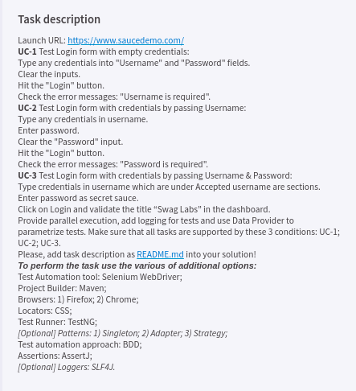

Automated UI tests using Selenium Web Driver for `https://saucedemo.com`

`Supported browsers: 
Chrome,
Firefox`

Browser environment by default is set to Chrome.
To run the default test suite with Chrome Driver run `mvn clean test`

To run the tests with Firefox browser use the following command:
`mvn clean test -Dbrowser=FIREFOX` or `mvn test -Dbrowser=FIREFOX`

